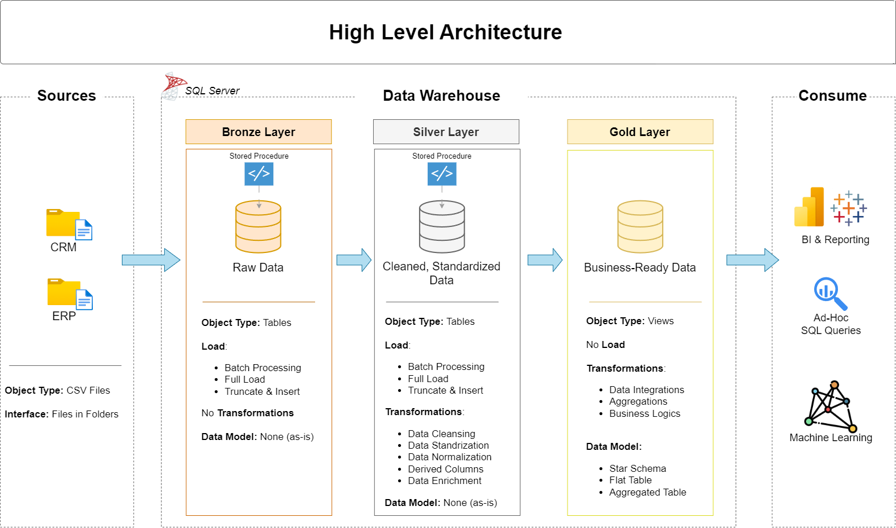
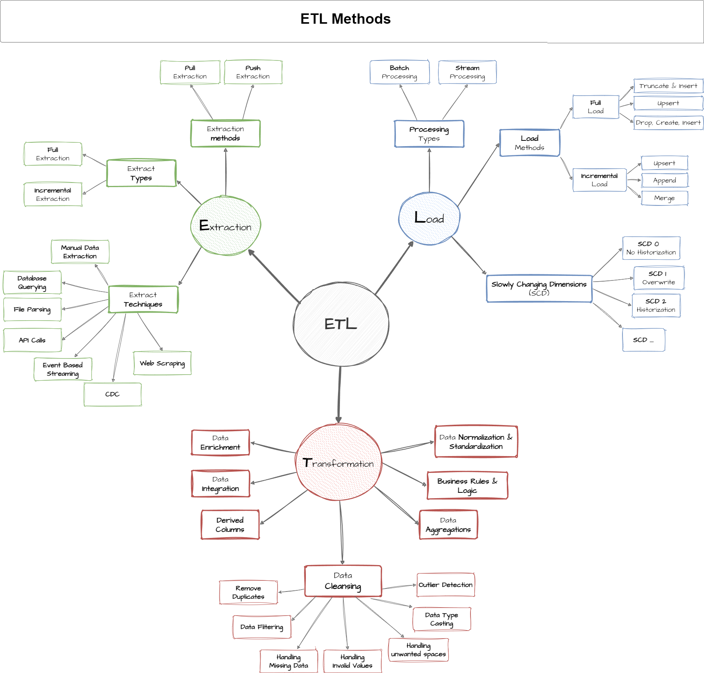
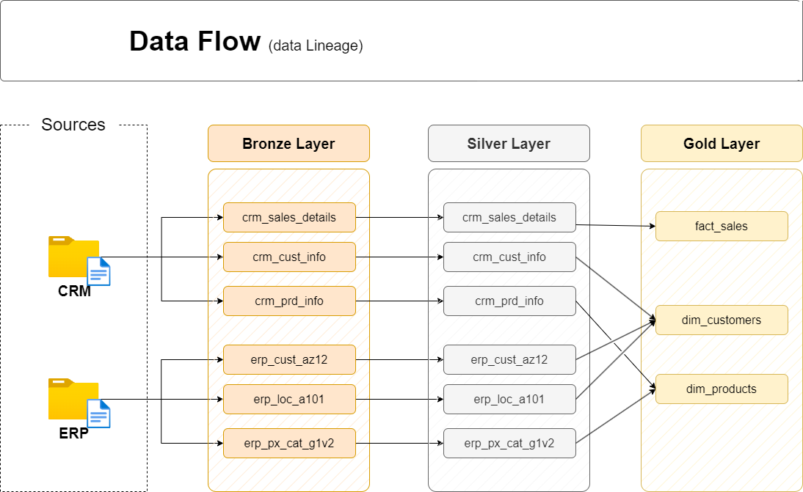
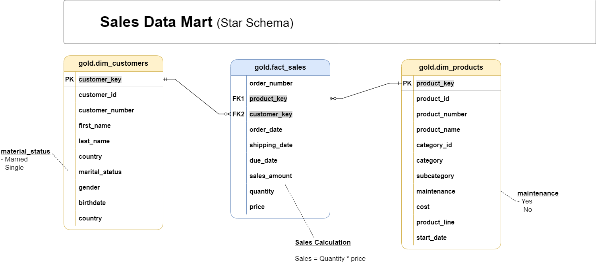

# Data Warehouse and Analytics Project

Welcome to my **Data Warehouse and Analytics Project**.

This project demonstrates how raw sales data from different source systems can be loaded, cleaned, transformed, and organized into a data warehouse using **SQL Server**.

The project follows a simple flow:

**Source Data → Bronze → Silver → Gold → Analytics**

---

## 🏗️ Data Architecture

This project follows the **Medallion Architecture**, which contains three layers:

**Bronze → Silver → Gold**

### Bronze Layer

The Bronze Layer stores the **raw data** from the source systems.

* Data is loaded from CSV files.
* The data is stored in its original form as much as possible.
* No major cleaning or transformation is performed at this stage.

### Silver Layer

The Silver Layer is used to **clean and prepare the data**.

* Handle missing values
* Fix incorrect values
* Standardize data
* Clean and transform columns
* Prepare the data for the Gold Layer

### Gold Layer

The Gold Layer contains **business-ready data**.

* Fact and dimension tables are created.
* A Star Schema is used.
* The data is prepared for reporting and analysis.
* SQL queries can be used to answer business questions.

### Data Architecture Diagram



---

## 📖 Project Overview

The project covers the following main areas:

### 1. Data Architecture

A data warehouse is designed using the **Bronze, Silver, and Gold** layers.

### 2. ETL Process

SQL scripts are used to:

* Load raw data
* Clean the data
* Transform the data
* Move data between the different layers
* Prepare the final data for analysis

### 3. Data Modeling

The Gold Layer contains **fact and dimension tables** organized using a **Star Schema**.

### 4. Data Analysis

SQL is used to analyze the final data and generate business insights related to:

* Customer behavior
* Product performance
* Sales trends

---

## 🎯 Project Objective

The main objective of this project is to build a **SQL Server Data Warehouse** that combines data from different source systems into one organized and analysis-ready database.

The project focuses on:

* Data loading
* Data cleaning
* Data transformation
* Data modeling
* Data quality checks
* SQL analysis
* Business insights

---

## 📊 Data Sources

The project uses data from two source systems:

* **CRM**
* **ERP**

The source data is provided as CSV files.

The data is first loaded into the Bronze Layer, then cleaned and transformed in the Silver Layer, and finally organized into business-ready tables in the Gold Layer.

---

## 🔄 ETL Process

The ETL process follows these steps:

**CSV Files**
↓
**Bronze Layer – Load Raw Data**
↓
**Silver Layer – Clean and Transform Data**
↓
**Gold Layer – Create Business-Ready Data**
↓
**SQL Analysis**

### ETL Diagram



---

## 🔁 Data Flow

The data moves through the warehouse in different stages.

1. Data is received from the CRM and ERP CSV files.
2. The raw data is loaded into the Bronze Layer.
3. The Silver Layer cleans and transforms the data.
4. The Gold Layer creates the final analytical model.
5. The Gold Layer is used for SQL analysis and reporting.

### Data Flow Diagram



---

## ⭐ Data Model

The Gold Layer follows a **Star Schema**.

It contains:

* **Fact tables** – store business transactions and measurable values.
* **Dimension tables** – store information used to describe and filter the facts.

This structure makes analytical queries easier to write and understand.

### Data Model Diagram



---

## 🧹 Data Quality

Data quality checks are performed to make sure the final data is reliable.

The checks include:

* Duplicate records
* Missing values
* Invalid values
* Incorrect data types
* Incorrect relationships
* Referential integrity
* Data consistency

These checks help make sure that the Gold Layer is suitable for analysis.

---

## 📈 Analytics and Reporting

The final data is analyzed using SQL.

The analysis focuses on three main areas:

### Customer Behavior

Understand customer purchasing behavior and activity.

### Product Performance

Analyze product sales and identify products that perform well.

### Sales Trends

Analyze sales over time and identify important sales patterns.

---

## 🗂️ Project Documentation

The project includes documentation and diagrams for the main parts of the data warehouse.

### Data Architecture

Shows the overall structure of the Bronze, Silver, and Gold layers.

### ETL Process

Shows how data is loaded, cleaned, transformed, and moved through the warehouse.

### Data Flow

Shows how data moves from the source systems to the final Gold Layer.

### Data Model

Shows the fact and dimension tables and their relationships.

### Data Catalog

Provides information about the datasets and their columns.

### Naming Conventions

Defines consistent naming rules used for tables, columns, and files.

---

## 📁 Project Structure

```text
data-warehouse-project/
│
├── datasets/
│   └── Raw CSV files from CRM and ERP
│
├── docs/
│   ├── images/
│   │   ├── data_architecture.png
│   │   ├── etl_process.png
│   │   ├── data_flow.png
│   │   └── data_model.png
│   │
│   ├── data_catalog.md
│   └── naming-conventions.md
│
├── scripts/
│   ├── bronze/
│   │   └── Scripts for loading raw data
│   │
│   ├── silver/
│   │   └── Scripts for cleaning and transforming data
│   │
│   └── gold/
│       └── Scripts for creating business-ready tables
│
├── tests/
│   └── Data quality checks
│
├── README.md
├── .gitignore
└── requirements.txt
```

---

## 🛠️ Tools Used

* **SQL Server** – Database and Data Warehouse
* **SQL** – Data loading, cleaning, transformation, and analysis
* **SSMS** – Working with SQL Server
* **GitHub** – Project version control and documentation
* **AI Assistance** – Used to support SQL development, documentation, and diagram creation

---

## 🚀 What I Learned

Through this project, I practiced:

* SQL Server
* SQL queries
* ETL processes
* Data cleaning
* Data transformation
* Data quality checks
* Data modeling
* Star Schema
* Fact and dimension tables
* Data warehouse architecture
* Analytical SQL
* Business-focused data analysis
* Using AI tools to support development and documentation

---

## 📌 Project Flow

```text
CRM CSV Files ──┐
                ├──> Bronze Layer
ERP CSV Files ──┘
                     │
                     ▼
              Silver Layer
            Cleaning & Transforming
                     │
                     ▼
                Gold Layer
          Fact + Dimension Tables
                     │
                     ▼
              SQL Analytics
                     │
                     ▼
             Business Insights
```

## 💡 Key Takeaway

This project helped me understand how raw data can be converted into clean, structured, and analysis-ready information through a complete **Data Warehouse and ETL process** using SQL Server.
